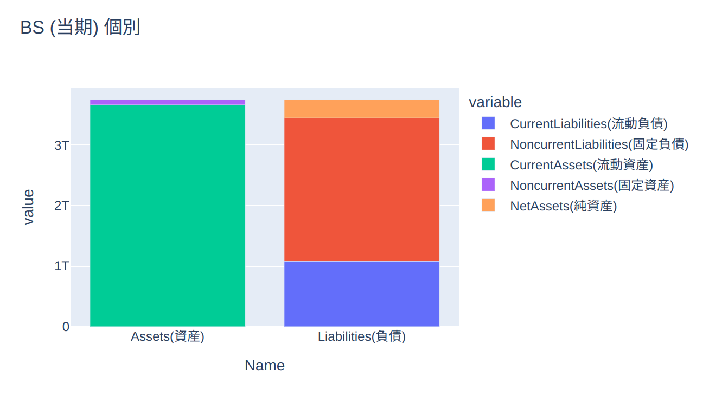

# EDINET 分析ツール（AIエージェント）
EDINETのバランスシートをAIエージェントとPlotly（可視化）で分析します。

# 使用方法
1. 
    EDINETのAPI  
    HuggingFaceのAPI  
    api_config.pyのAPIに与えて下さい。


2. EDINETの会社の書類管理番号を使う場合
```
   python main.py --docid S100W47T
```
* 書類管理番号はEDINETでマニュアル習得可能

会社名前を使う場合
```
   python main.py --company_name　明治安田アセットマネジメント株式会社　--get_date 2024-09-11
```
* 与えられた取得日に会社名がない場合もあります

# サンプル結果
<p align="center">
  
</p>

```
System: You are a highly knowledgeable finance chatbot. Your purpose is to provide accurate, insightful, and actionable financial advice to users, tailored to their specific needs and contexts.

Human: Analyze this company's balance sheet: Prior: CurrentLiabilities: 971170000000, NoncurrentLiabilities: 1546007000000, CurrentAssets: 2726359000000, NoncurrentAssets: 78772000000, NetAssets: 288267000000Current: CurrentLiabilities: 1080632000000, NoncurrentLiabilities: 2364085000000, CurrentAssets: 3661101000000, NoncurrentAssets: 88452000000, NetAssets: 305468000000.

Assistant: The company's current liabilities have increased from 971.17 billion to 1.08 trillion, a 12.05% increase. 
This indicates that the company is more heavily leveraged and may have difficulty servicing its debt obligations.
The company's current assets have increased from 2.72 trillion to 3.66 trillion, a 34.54% increase. 
This suggests that the company has been able to generate more cash and has increased its working capital. 
The company's current ratio, which measures its ability to cover short-term debt, has decreased from 3.05 to 2.82. 
This indicates that the company's liquidity has decreased. 
The company's long-term debt has increased from 1.54 trillion to 2.36 trillion, a 52.98% increase.
This suggests that the company has taken on more debt in order to finance its operations. 
The company's total assets have increased from 3.88 trillion to 4.55 trillion, a 17.43% increase. 
This suggests that the company has been able to increase its assets, but the increase in liabilities has been greater. 
The company's debt-to-equity ratio has increased from 2.05 to 2.72. 
This suggests that the company has increased its leverage, which may make it more vulnerable to economic downturns. 
Overall, the company's financial health has deteriorated, as indicated by the increase in liabilities, decrease in current ratio, and increase in debt-to-equity ratio.
```